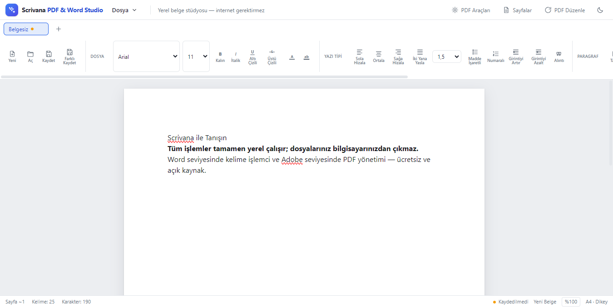
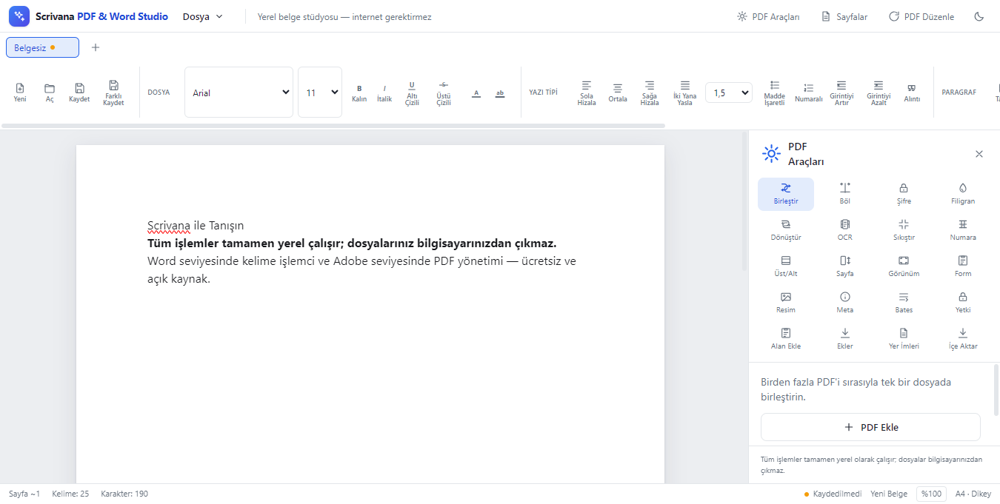
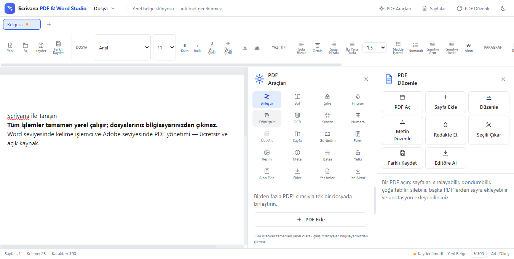
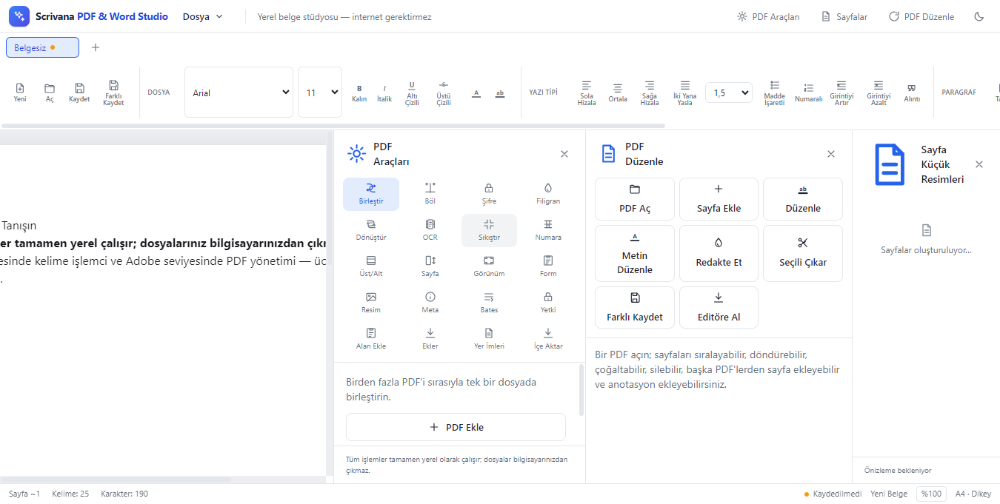

# Scrivana PDF & Word Studio

[](LICENSE)


[](https://github.com/furykingisback/scrivana)
[](https://github.com/furykingisback/scrivana/releases)

> **Free & open-source PDF + Word editor that runs 100% offline.** No subscriptions, no cloud, no data leaks. Your files never leave your computer.
>
> **100% yerel çalışan ücretsiz ve açık kaynaklı PDF + Word editörü.** Abonelik yok, bulut yok, veri sızıntısı yok. Dosyalarınız asla bilgisayarınızdan çıkmaz.

<!-- Örnek: SCREENSHOT GIF EKLEMEK İSTERSENİZ:

-->

Profesyonel masaüstü belge stüdyosu: Word seviyesinde kelime işlemci ve Adobe seviyesinde PDF yönetim merkezi. **Tüm işlemler tamamen yerel olarak çalışır** — dosyalarınız bilgisayarınızdan asla çıkmaz, internet veya bulut gerekmez.

## Ekran Görüntüleri

Ana editör (sayfa üzerinde kelime işlemci):



PDF Araçları paneli (birleştir, böl, sıkıştır, dönüştür, OCR, güvenlik):



PDF Düzenleme (sayfa sıralama, silme, döndürme, metin ekleme/vurgulama):



Sayfa küçük resimleri (belge gezinme):



## Özellikler

### Kelime İşlemci (Word düzeyi)
- Zengin metin editörü (biçimlendirme, renk, vurgu, hizalama, satır aralığı, tablolar, resim, bağlantı)
- Sayfa boyutu / yön / kenar boşlukları, üstbilgi-üstbilgi & sayfa numarası, arka plan rengi
- Yazım denetimi (yerel spellcheck), karakter sayacı, yer imleri
- Word (.docx) içe/dışa aktarma, Word şablonları ({{alan}} değişkenleri), PDF görsel içe aktarma (her sayfa görsel olarak editöre gömülür)

### PDF Yönetimi (Acrobat düzeyi)
- **Sayfalar:** Düzenleme (sırala/sil/döndür), sayfa numaraları, Bates numaralandırma, üst/alt bilgi, boyut değiştirme, arka plan, filigran
- **Metin:** Metin çıkarma, arama, akıllı içe aktarma (OCR yedeğiyle), metin düzenleme, redakte (karalama)
- **Görsel:** Sayfaları PNG/JPEG'e dışa aktarma, görsellerden PDF oluşturma
- **Formlar:** Form alanlarını listeleme, doldurma, yeni alan ekleme
- **Güvenlik:** Şifreleme/şifre çözme, sahip izinleri, dijital imza, dosya ekleme
- **Dönüşüm:** PDF → Word, PDF → HTML (görsel), OCR ile taranmış PDF'den aranabilir metin üretimi
- **Diğer:** Birleştirme, bölme, sıkıştırma, meta veri, yer imleri (outline), sayfa küçük resimleri

## Teknolojiler

- [Electron](https://www.electronjs.org/) + [Next.js](https://nextjs.org/) + React + TypeScript
- [Tiptap](https://tiptap.dev/) — kelime işlemci editörü
- [pdf-lib](https://pdf-lib.js.org/) / [pdfjs-dist](https://mozilla.github.io/pdf.js/) / [tesseract.js](https://tesseract.projectnaptha.com/) — PDF işlemleri ve OCR
- [@napi-rs/canvas](https://github.com/Brooooooklyn/canvas) — tuval tabanlı PDF görselleştirme
- Vitest + Playwright — testler

## Kurulum

### Sistem Gereksinimleri

| Bileşen | Gereksinim |
| --- | --- |
| İşletim sistemi | Windows 10 veya 11 (64-bit) |
| Bellek | En az 4 GB RAM (önerilen: 8 GB) |
| Disk | ~400 MB boş alan |
| İnternet | Yalnızca indirme sırasında gerekli; uygulama çevrimdışı çalışır |

### Seçenek 1 — Kurulum (önerilen)

1. **GitHub Releases** sayfasından `Scrivana PDF & Word Studio-Setup-1.0.0-x64.exe` dosyasını indirin.
2. İndirilen exe'ye çift tıklayın.
3. Kurulum sihirbazındaki adımları izleyin (varsayılan yollar önerilir).
4. Kurulum tamamlandığında uygulama başlat menüsünde ve masaüstünde kısayol olarak görünür.

> **Windows SmartScreen uyarısı:** Kurulum imzasız olduğu için Windows "Bilinmeyen yayımcı" uyarısı gösterebilir. Açılan pencerede **"Yine de çalıştır"** (More info → Run anyway) düğmesine tıklayın. Uygulama açık kaynaklıdır; isterseniz kaynak koddan derleyerek çalıştırabilirsiniz.

### Seçenek 2 — Taşınabilir (portable)

Kurulum istemeyenler için:

1. **GitHub Releases** sayfasından `Scrivana PDF & Word Studio-Portable-1.0.0-x64.exe` dosyasını indirin.
2. Dosyayı istediğiniz klasöre kopyalayın (USB bellek dahil).
3. exe'ye çift tıklayın — kurulum gerektirmez.

> Tüm ayarlar ve son açılan belgeler aynı klasörde `userData` altında tutulur; taşınabilir kullanımda belgelerinizi kaydettiğiniz yere taşıyabilirsiniz.

### Seçenek 3 — Kaynaktan derleme

Geliştiriciler için (Node.js 18+ gerekir):

```bash
# 1. Depoyu kopyalayın
git clone https://github.com/furykingisback/scrivana.git
cd scrivana

# 2. Bağımlılıkları kurun
npm install

# 3. Windows için paketleyin (NSIS kurulum + portable)
npm run dist:win
```

Paketlenmiş dosyalar `release/` klasörüne çıkar:

- `Scrivana PDF & Word Studio-Setup-1.0.0-x64.exe` — kurulum
- `Scrivana PDF & Word Studio-Portable-1.0.0-x64.exe` — taşınabilir

## Geliştirme

Gereksinimler: Node.js 18+

```bash
npm install

# Geliştirme modu (Next.js + Electron)
npm run dev
```

## Yapı ve test

```bash
npm run typecheck   # Tip kontrolü
npm test            # Birim testleri (Vitest)
npm run test:e2e    # Uçtan uca testler (Playwright + paketli uygulama)

# Windows için paketleme (NSIS + portable)
npm run dist:win
```

## Gizlilik

Uygulama **%100 yerel** çalışır. Belge işleme (PDF, OCR, dönüşüm) bilgisayarınızda gerçekleşir; hiçbir veri dışarı gönderilmez.

## Lisans

[MIT](LICENSE)
